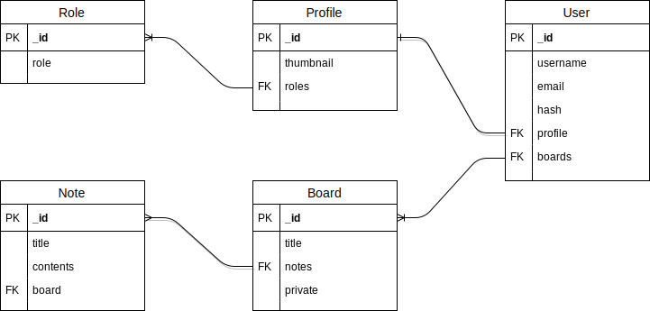

# MDialy Server

## API Endpoints

### **/user/**

| method | auth | endpoint           | description |
|:-------|:----:|:-------------------|:------------|
| GET    |  o   | /:username/profile | プロフィール取得  |
| PUT    |  o   | /:username/profile | プロフィールを編集 |

### **/board/**

| method | auth | endpoint           | description            | body                                  | params      |
|:-------|:----:|:-------------------|:-----------------------|:--------------------------------------|:------------|
| GET    |  o   | /board             | ユーザが所有するすべてのボードを取得 |                                       |             |
| POST   |  o   | /board             | 新規ボードを作成           | title: string,  isPrivate: boolean  |             |
| GET    |      | /board/:boardName | タイトルからボードを取得         |                                       | :boardName |
| DELETE |  o   | /board/:boardName | タイトルからボードを削除         |                                       | :boardName |

### **/note/**

| method | auth | endpoint  | description  | body | params |
|:-------|:----:|:----------|:-------------|:-----|:-------|
| POST   |  o   | /board/:boardName/note     | 新規ノートを作成 |      | :title |
| GET    |      | /board/:boardName/note/:noteid | IDからノートを取得 |      |        |
| PUT    |  o   | /board/:boardName/note/:noteid | ノートを編集     |      |        |
| DELETE |  o   | /board/:boardName/note/:noteid | ノートを削除     |      |        |

### **/auth**

| method | auth | endpoint   | description   | body                                              | params |
|:-------|:----:|:-----------|:--------------|:--------------------------------------------------|:-------|
| POST   |      | /register  | 新規ユーザ登録   | password: string,  username: string,  email: string |        |
| POST   |      | /signin    | ログイン          | password: string, username: string                |        |
| GET    |  o   | /protected | authが必要なページ |                                                   |        |

### **/admin**

## Diagram

## カスタムエラーハンドラ
